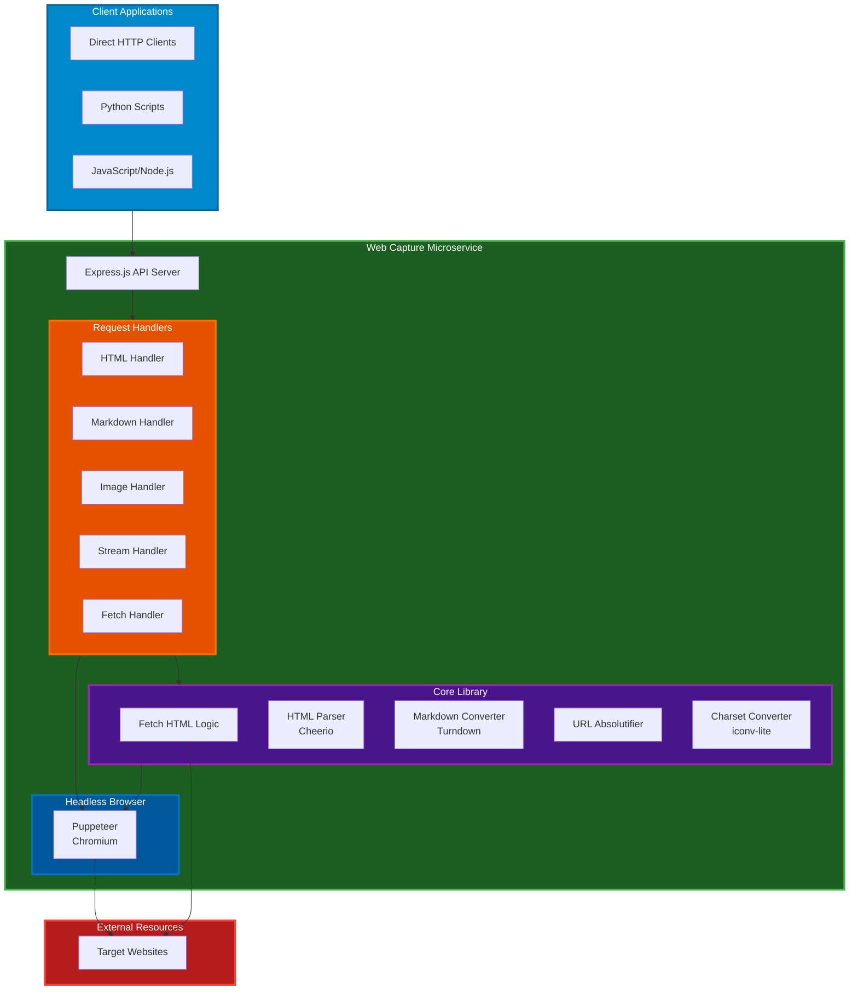
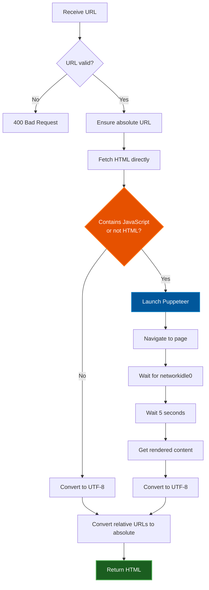
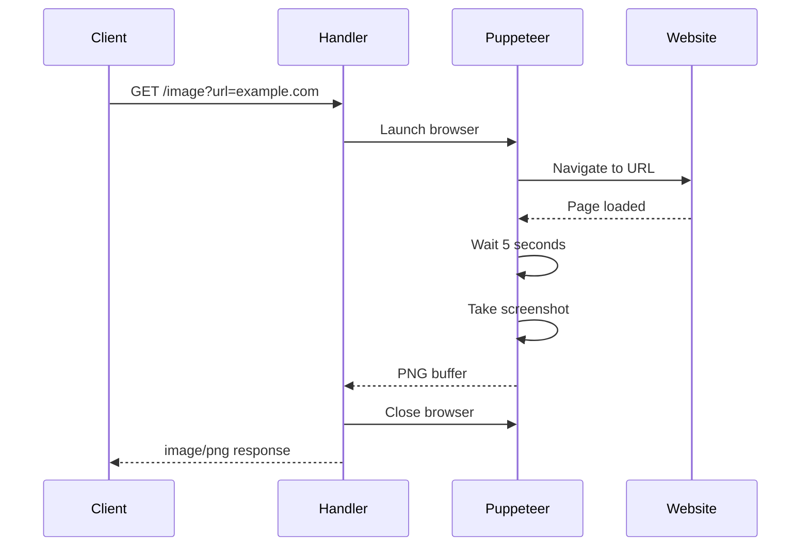

# Web Capture Architecture

## Overview

Web Capture is a lightweight microservice designed to fetch web pages and render them in multiple formats: HTML, Markdown, and PNG screenshots. It supports both Puppeteer and Playwright browser engines for headless browser automation to handle JavaScript-heavy websites and provides clean, processed output suitable for AI/LLM consumption, documentation, and archival purposes.

**Version**: 1.0.0
**License**: Unlicense (public domain)
**Runtime**: Node.js 22.x
**Module System**: ES Modules (type: "module")

---

## System Architecture

### High-Level Architecture



---

## Directory Structure

```
web-capture/
├── src/
│   ├── index.js           # Express server entry point
│   ├── browser.js         # Browser abstraction layer (Puppeteer & Playwright)
│   ├── html.js            # HTML endpoint handler
│   ├── markdown.js        # Markdown endpoint handler
│   ├── image.js           # Screenshot endpoint handler
│   ├── stream.js          # Stream endpoint handler (stub)
│   ├── fetch.js           # Fetch endpoint handler (stub)
│   └── lib.js             # Core utility functions
│
├── tests/
│   ├── unit/              # Unit tests
│   │   ├── html2md.test.js
│   │   ├── convertRelativeUrls.test.js
│   │   └── browser.test.js
│   ├── integration/       # Integration tests
│   │   └── browser-engines.test.js
│   ├── e2e/               # End-to-end tests
│   │   ├── process.test.js
│   │   └── docker.test.js
│   ├── mock/              # Mock tests
│   │   └── index.test.js
│   └── jest.setup.mjs     # Jest setup
│
├── examples/
│   ├── js/                # JavaScript examples
│   │   ├── html_download.js
│   │   ├── markdown_download.js
│   │   ├── image_download.js
│   │   ├── playwright_example.js
│   │   └── engine_comparison.js
│   └── python/            # Python examples
│       ├── html_download.py
│       ├── markdown_download.py
│       ├── image_download.py
│       └── playwright_example.py
│
├── docs/
│   └── market-analysis-2025-05-13.md
│
├── Dockerfile             # Container definition
├── docker-compose.yml     # Docker orchestration
├── package.json           # Dependencies & scripts
├── jest.config.mjs        # Jest configuration
├── babel.config.cjs       # Babel configuration
├── apply.sh               # Deployment/apply script
└── LICENSE                # Unlicense
```

---

## Core Components

### 1. Express Server (`src/index.js`)

**Entry Point**: Main HTTP server with Express.js

**Endpoints**:
- `GET /html?url=<URL>` - Raw HTML or Puppeteer-rendered HTML
- `GET /markdown?url=<URL>` - Markdown conversion
- `GET /image?url=<URL>` - PNG screenshot
- `GET /stream?url=<URL>` - Stream handler (future)
- `GET /fetch?url=<URL>` - Fetch handler (future)

**Features**:
- Graceful shutdown handling (SIGTERM, SIGINT)
- Process PID logging
- Uncaught exception handling
- Docker-friendly timeout (2s force exit)

**Server Configuration**:
```javascript
const port = process.env.PORT || 3000;
app.listen(port, () => {
  console.log(`Renderer service listening on http://localhost:${port}`);
});
```

---

### 2. HTML Handler (`src/html.js`)

**Purpose**: Fetch and return HTML content, with JavaScript rendering support

#### Processing Flow



**Key Features**:
- **Smart Detection**: Checks if HTML contains JavaScript or is not valid HTML
- **Puppeteer Rendering**: For JS-heavy sites, renders with headless Chrome
- **UTF-8 Conversion**: Ensures proper character encoding
- **URL Absolutification**: Converts all relative URLs to absolute
- **Runtime JS Hook**: Injects JavaScript to fix dynamically loaded URLs

**Puppeteer Configuration**:
```javascript
const browser = await puppeteer.launch({
  args: ['--no-sandbox', '--disable-setuid-sandbox']
});
await page.setViewport({ width: 1280, height: 800 });
await page.goto(url, {
  waitUntil: 'networkidle0',
  timeout: 30000
});
```

---

### 3. Markdown Handler (`src/markdown.js`)

**Purpose**: Convert web pages to clean, readable Markdown

**Process**:
1. Fetch HTML (via `fetchHtml`)
2. Convert to Markdown (via `convertHtmlToMarkdown`)
3. Return as `text/markdown`

**Output**: Clean Markdown suitable for:
- AI/LLM ingestion
- Documentation
- Note-taking systems
- Text analysis

---

### 4. Image Handler (`src/image.js`)

**Purpose**: Capture PNG screenshots of web pages

**Features**:
- Viewport-only screenshot (not full page)
- Fixed viewport size: 1280x800
- 5-second wait for dynamic content
- PNG format output

**Process**:


**Response Headers**:
```javascript
res.set('Content-Type', 'image/png');
res.set('Content-Disposition', 'inline; filename="screenshot.png"');
```

---

### 5. Core Library (`src/lib.js`)

#### Key Functions

**`fetchHtml(url)`**
- Simple fetch wrapper using node-fetch
- Returns HTML as text

**`convertHtmlToMarkdown(html, baseUrl)`**
- Converts HTML to Markdown using Turndown
- Cleans HTML before conversion
- Absolutifies all URLs

**HTML Cleaning Operations**:
1. Remove `<style>`, `<script>`, `<noscript>` tags
2. Remove inline event handlers (`onclick`, `onload`, etc.)
3. Remove `javascript:` links
4. Remove inline `style` attributes
5. Remove empty headings
6. Remove empty links
7. Remove links with only images (no alt text)
8. Convert ARIA role tables to semantic `<table>` elements

**`convertRelativeUrls(html, baseUrl)`**
- Converts all relative URLs to absolute
- Handles: `<a>`, ``, `<script>`, `<link>`, `<form>`, `<video>`, `<audio>`, `<iframe>`, etc.
- Processes inline `style` with `url()` references
- Injects runtime JavaScript hook for dynamic content

**Runtime JavaScript Hook**:
```javascript
// Injected script that fixes URLs dynamically
fixAllUrls(document);
const observer = new MutationObserver((mutations) => {
  // Fix URLs in newly added elements
});
observer.observe(document.body, { childList: true, subtree: true });
```

**`convertToUtf8(html)`**
- Detects charset from `<meta>` tag
- Converts HTML to UTF-8 using iconv-lite
- Updates charset meta tag

**Charset Detection**:
```javascript
const charsetMatch = html.match(/<meta[^>]+charset=["']?([^"'>\s]+)/i);
const currentCharset = charsetMatch ? charsetMatch[1].toLowerCase() : 'utf-8';
```

---

### 6. Browser Abstraction Layer (`src/browser.js`)

**Purpose**: Unified interface supporting both Puppeteer and Playwright browser engines

#### Key Features

- **Engine Selection**: Choose between Puppeteer and Playwright via query parameter or environment variable
- **Unified API**: Same interface for both engines, enabling easy switching
- **Automatic Adaptation**: Translates engine-specific options (e.g., `networkidle0` to `networkidle` for Playwright)
- **Backward Compatibility**: Defaults to Puppeteer for existing deployments

#### Browser Factory

**`createBrowser(engine, options)`**
- Creates a browser instance using the specified engine
- Returns a unified `BrowserAdapter` object
- Supported engines: `'puppeteer'` or `'playwright'`

**`getBrowserEngine(req)`**
- Determines which browser engine to use
- Priority: query parameter > environment variable > default (puppeteer)
- Supported query params: `engine` or `browser`
- Supported values: `puppeteer`, `pptr`, `playwright`, `pw` (case-insensitive)

#### Browser Adapter Interface

```javascript
{
  async newPage()      // Create a new page
  async close()        // Close the browser
  type                 // Engine type ('puppeteer' or 'playwright')
  _browser             // Original browser object (internal)
}
```

#### Page Adapter Interface

```javascript
{
  async setExtraHTTPHeaders(headers)  // Set HTTP headers
  async setUserAgent(userAgent)       // Set user agent
  async setViewport(viewport)         // Set viewport size
  async goto(url, options)            // Navigate to URL
  async content()                     // Get page HTML
  async screenshot(options)           // Take screenshot
  async close()                       // Close the page
  _page                               // Original page object (internal)
  _type                               // Engine type
}
```

#### Engine Differences Handled

The abstraction layer automatically handles differences between engines:

1. **Viewport Setting**:
   - Puppeteer: `page.setViewport()`
   - Playwright: `page.setViewportSize()`

2. **Network Idle Strategy**:
   - Puppeteer: `waitUntil: 'networkidle0'`
   - Playwright: `waitUntil: 'networkidle'`

3. **Browser Launch**:
   - Puppeteer: `puppeteer.launch()`
   - Playwright: `playwright.chromium.launch()`

#### Usage Examples

**Using Puppeteer (default)**:
```javascript
const browser = await createBrowser('puppeteer');
const page = await browser.newPage();
await page.goto('https://example.com');
const html = await page.content();
await browser.close();
```

**Using Playwright**:
```javascript
const browser = await createBrowser('playwright');
const page = await browser.newPage();
await page.goto('https://example.com');
const html = await page.content();
await browser.close();
```

**In Request Handlers**:
```javascript
export async function htmlHandler(req, res) {
  const engine = getBrowserEngine(req);  // From query param or env
  const browser = await createBrowser(engine);
  // ... rest of implementation
}
```

---

## API Documentation

### GET /html

**Description**: Fetch and return HTML content

**Parameters**:
- `url` (required): Target URL
- `engine` (optional): Browser engine (`puppeteer` or `playwright`). Default: `puppeteer`

**Response**:
- `Content-Type: text/html; charset=utf-8`
- Body: HTML content

**Examples**:
```bash
# Using default Puppeteer engine
curl "http://localhost:3000/html?url=https://example.com"

# Using Playwright engine
curl "http://localhost:3000/html?url=https://example.com&engine=playwright"
```

**Behavior**:
- Plain HTML sites: Direct fetch + UTF-8 conversion + URL absolutification
- JavaScript sites: Browser rendering (Puppeteer or Playwright) + 5s wait + URL absolutification

---

### GET /markdown

**Description**: Convert web page to Markdown

**Parameters**:
- `url` (required): Target URL

**Response**:
- `Content-Type: text/markdown`
- Body: Markdown content

**Example**:
```bash
curl "http://localhost:3000/markdown?url=https://example.com" > page.md
```

**Features**:
- GitHub Flavored Markdown (GFM)
- Clean, readable output
- Absolute URLs preserved
- Code blocks with fenced syntax

---

### GET /image

**Description**: Capture PNG screenshot

**Parameters**:
- `url` (required): Target URL
- `engine` (optional): Browser engine (`puppeteer` or `playwright`). Default: `puppeteer`

**Response**:
- `Content-Type: image/png`
- `Content-Disposition: inline; filename="screenshot.png"`
- Body: PNG image buffer

**Examples**:
```bash
# Using default Puppeteer engine
curl "http://localhost:3000/image?url=https://example.com" > screenshot.png

# Using Playwright engine
curl "http://localhost:3000/image?url=https://example.com&engine=playwright" > screenshot.png
```

**Screenshot Specs**:
- Viewport: 1280x800
- Wait time: 5 seconds after load
- Format: PNG
- Scope: Viewport only (not full page)

---

## Deployment

### Docker

**Dockerfile** (Node 22 + Chromium):
```dockerfile
FROM node:22-bullseye

# Install Chromium and dependencies
RUN apt-get update && apt-get install -y \
    chromium \
    fonts-liberation \
    # ... more dependencies
    --no-install-recommends

# Puppeteer environment
ENV PUPPETEER_SKIP_CHROMIUM_DOWNLOAD=true
ENV PUPPETEER_EXECUTABLE_PATH=/usr/bin/chromium
ENV PUPPETEER_ARGS="--no-sandbox --disable-setuid-sandbox --disable-dev-shm-usage"

COPY package.json yarn.lock ./
RUN yarn install --frozen-lockfile

COPY . .
EXPOSE 3000
ENTRYPOINT ["node", "bin/web-capture.js", "--serve"]
```

### Docker Compose

```yaml
version: '3.8'
services:
  web-capture:
    build: .
    ports:
      - "3000:3000"
    restart: unless-stopped
    environment:
      - PORT=3000
```

**Commands**:
```bash
# Build and start
yarn start  # or docker compose up -d

# Build manually
docker build -t web-capture .
docker run -p 3000:3000 web-capture
```

---

## Usage Examples

### JavaScript (Node.js)

```javascript
// examples/js/markdown_download.js
import fetch from 'node-fetch';
import fs from 'fs';

const url = 'https://example.com';
const response = await fetch(`http://localhost:3000/markdown?url=${encodeURIComponent(url)}`);
const markdown = await response.text();
fs.writeFileSync('downloaded.md', markdown);
```

### Python

```python
# examples/python/markdown_download.py
import requests

url = 'https://example.com'
response = requests.get(f'http://localhost:3000/markdown', params={'url': url})
with open('downloaded.md', 'w') as f:
    f.write(response.text)
```

---

## Testing

### Test Structure

**Unit Tests** (`tests/unit/`):
- `html2md.test.js` - Markdown conversion tests
- `convertRelativeUrls.test.js` - URL absolutification tests

**E2E Tests** (`tests/e2e/`):
- `process.test.js` - Local process tests
- `docker.test.js` - Docker container tests

**Mock Tests** (`tests/mock/`):
- `index.test.js` - Mocked HTTP tests with nock

### Running Tests

```bash
# All unit tests
yarn test

# Watch mode
yarn test:watch

# E2E tests (local process)
yarn test:e2e:process

# E2E tests (Docker)
yarn test:e2e:docker

# All tests (build + unit + e2e)
yarn test:all
```

### Test Framework

**Jest Configuration**:
```javascript
export default {
  testEnvironment: 'node',
  transform: {
    '^.+\\.m?js$': 'babel-jest',
  },
  moduleNameMapper: {
    '^(\\.{1,2}/.*)\\.js$': '$1',
  },
  testMatch: ['**/tests/**/*.test.js'],
};
```

**Tools**:
- Jest 29.7.0
- Supertest (HTTP assertions)
- Nock (HTTP mocking)
- Babel (ES modules support)

---

## Configuration

### Environment Variables

**General**:
- `PORT` - Server port (default: 3000)
- `BROWSER_ENGINE` - Default browser engine (`puppeteer` or `playwright`)

**Puppeteer**:
- `PUPPETEER_EXECUTABLE_PATH` - Chromium path (Docker: `/usr/bin/chromium`)
- `PUPPETEER_SKIP_CHROMIUM_DOWNLOAD` - Skip bundled Chromium (Docker: `true`)
- `PUPPETEER_ARGS` - Additional Puppeteer launch args

**Playwright**:
- `PLAYWRIGHT_CHROMIUM_EXECUTABLE_PATH` - Chromium path (Docker: `/usr/bin/chromium`)
- `PLAYWRIGHT_SKIP_BROWSER_DOWNLOAD` - Skip browser download (Docker: `1`)

### Browser Configuration

**Browser Launch Args** (both engines):
```javascript
args: [
  '--no-sandbox',              // Required for Docker
  '--disable-setuid-sandbox',  // Required for Docker
  '--disable-dev-shm-usage'    // Avoid shared memory issues
]
```

**Page Options** (both engines):
- User Agent: Chrome 120 on Windows 10
- Viewport: 1280x800
- Wait strategy: `networkidle0` (Puppeteer) / `networkidle` (Playwright)
- Timeout: 30 seconds
- Additional wait: 5 seconds for dynamic content

---

## Dependencies

### Production

```json
{
  "cheerio": "^1.0.0",           // HTML parsing
  "express": "^4.18.2",          // Web server
  "node-fetch": "^2.7.0",        // HTTP client
  "playwright": "^1.49.0",       // Headless browser (Playwright)
  "puppeteer": "^24.8.2",        // Headless browser (Puppeteer)
  "turndown": "^7.1.1"           // HTML to Markdown
}
```

### Development

```json
{
  "@babel/core": "^7.24.0",                // Babel core
  "@babel/preset-env": "^7.24.0",          // Babel preset
  "babel-jest": "^29.7.0",                 // Jest Babel integration
  "get-port": "^7.1.0",                    // Find available port
  "jest": "^29.7.0",                       // Test framework
  "nock": "^13.5.4",                       // HTTP mocking
  "supertest": "^6.3.4",                   // HTTP assertions
  "turndown-plugin-gfm": "^1.0.2"          // GitHub Flavored Markdown
}
```

---

## Performance

### Resource Usage

- **Memory**: ~200-500MB (Puppeteer + Chromium)
- **CPU**: Moderate during rendering
- **Disk**: Minimal (no storage)
- **Network**: Depends on target website

### Optimization Opportunities

1. **Browser Pooling**: Reuse Puppeteer browser instances instead of launching for each request
2. **Caching**: Cache rendered HTML/screenshots with TTL
3. **Queue System**: Background processing for slow requests
4. **Resource Limits**: Set memory/CPU limits for Puppeteer
5. **Parallel Processing**: Handle multiple requests concurrently
6. **Data Storage**: Migrate to [links-notation](https://github.com/link-foundation/links-notation) for caching results, then to [Doublets](https://github.com/linksplatform/Data.Doublets) for efficient Associative Knowledge Network storage of web content relationships

### Timeouts

- Page navigation: 30 seconds
- Post-load wait: 5 seconds
- Server shutdown: 2 seconds

---

## Security Considerations

### Input Validation

- URL parameter is required
- URL is validated and made absolute
- Malicious URLs (javascript:, data:, blob:) are handled

### Puppeteer Security

- `--no-sandbox` required for Docker (but reduces isolation)
- User agent spoofing (appears as regular browser)
- No persistent browser data
- Fresh browser instance per request

### Content Sanitization

**Markdown Conversion**:
- Removes `<script>` tags
- Removes inline event handlers
- Removes `javascript:` links
- Removes inline styles

**HTML Output**:
- Preserves original content (intentionally)
- Converts to UTF-8 for consistency

### Docker Security

- Non-root user execution (recommended but not implemented)
- Read-only filesystem (can be configured)
- Resource limits (can be configured)

---

## Known Issues & TODOs

### Active Issues

1. **Stream/Fetch Endpoints**: Stub implementations (not functional)
2. **Browser Reuse**: New browser launched per request (inefficient)
3. **No Caching**: Every request hits the target website
4. **No Rate Limiting**: Can be abused
5. **Large Pages**: Full page screenshots not supported

### Recommended Improvements

1. **Browser Pool**: Implement Puppeteer browser pooling for efficiency
2. **Caching Layer**: Redis or in-memory cache for frequent URLs
3. **Rate Limiting**: Per-IP or per-URL rate limiting
4. **Authentication**: Optional API key authentication
5. **Metrics**: Prometheus metrics for monitoring
6. **Logging**: Structured logging (Winston/Pino)
7. **Error Handling**: More granular error responses
8. **Full Page Screenshots**: Option for full-page captures
9. **PDF Export**: Add `/pdf` endpoint
10. **Content Storage**: Migrate from ephemeral to [links-notation](https://github.com/link-foundation/links-notation) (human-readable) then [Doublets](https://github.com/linksplatform/Data.Doublets) (Associative Knowledge Network) for persistent storage and content relationship mapping

---

## Troubleshooting

### Common Issues

**1. "Error fetching HTML"**
- Check if target URL is accessible
- Verify network connectivity
- Check if URL requires authentication

**2. "Error capturing screenshot"**
- Target website may block headless browsers
- Page may have infinite loading scripts
- Try increasing timeout

**3. Puppeteer launch failed**
- In Docker: Ensure Chromium dependencies are installed
- Check `--no-sandbox` flag is present
- Verify `PUPPETEER_EXECUTABLE_PATH`

**4. Memory issues**
- Chromium is memory-intensive
- Consider increasing Docker memory limits
- Implement browser pooling

**5. Timeout errors**
- Increase `timeout` in page.goto()
- Some sites take > 30s to load
- Check if site requires user interaction

### Debug Mode

```bash
# Enable Puppeteer debugging
DEBUG=puppeteer:* node src/index.js

# Verbose logging
NODE_ENV=development node src/index.js
```

---

## Development

### Local Setup

```bash
# Install dependencies
yarn install

# Run in development mode (with nodemon)
yarn dev

# Access the service
curl http://localhost:3000/html?url=https://example.com
```

### Running Examples

```bash
# JavaScript examples
yarn examples:javascript

# Python examples
yarn examples:python

# All examples (requires Docker build)
yarn examples
```

### Adding a New Endpoint

1. Create handler in `src/`:
```javascript
// src/myEndpoint.js
export async function myEndpointHandler(req, res) {
  const url = req.query.url;
  // Implementation
  res.send(result);
}
```

2. Register in `src/index.js`:
```javascript
import { myEndpointHandler } from './myEndpoint.js';
app.get('/my-endpoint', myEndpointHandler);
```

3. Add tests in `tests/unit/`:
```javascript
// tests/unit/myEndpoint.test.js
test('myEndpoint works', async () => {
  // Test implementation
});
```

---

## License

This software is released into the **public domain** under the [Unlicense](https://unlicense.org).

**Important**: The Unlicense is NOT the same as having no license or being "unlicensed". The Unlicense is a specific public domain dedication that explicitly grants everyone the freedom to use, modify, and distribute this software without restrictions.

Anyone is free to copy, modify, publish, use, compile, sell, or distribute this software, either in source code form or as a compiled binary, for any purpose, commercial or non-commercial, and by any means.

For the full license text, see the [LICENSE](LICENSE) file or visit [unlicense.org](https://unlicense.org).

---

## Contributors

Deep.Assistant Team

---

## Glossary

- **Puppeteer**: Node library for controlling headless Chrome/Chromium
- **Playwright**: Cross-browser automation library supporting Chromium, Firefox, and WebKit
- **Cheerio**: Fast, flexible HTML parser for Node.js
- **Turndown**: HTML to Markdown converter
- **iconv-lite**: Character encoding conversion library
- **Headless Browser**: Browser without GUI, controlled programmatically
- **networkidle0**: Page load state in Puppeteer (no network activity for 500ms)
- **networkidle**: Page load state in Playwright (similar to networkidle0)
- **UTF-8**: Universal character encoding standard
- **GFM**: GitHub Flavored Markdown
- **ARIA**: Accessible Rich Internet Applications (web accessibility standard)
- **Viewport**: Visible area of a web page
- **ES Modules**: JavaScript module system (import/export)
- **Browser Abstraction Layer**: Unified interface supporting multiple browser engines

---

*Document generated: 2025-10-25*
*Version: 1.0.0*
